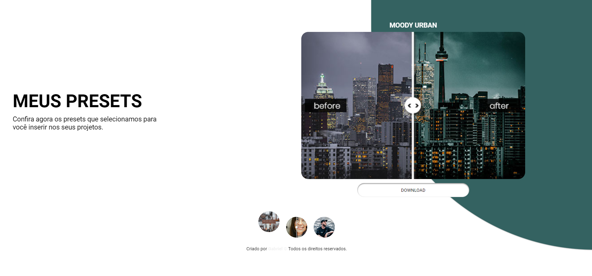

# Meus Presets

## Resumo

Projeto criando para estudar melhor os evento do javascript. A intenção desse projeto é você poder ver uma prévia quando clicar nos presets "botões circulares", quando são acionados os botões com o click o preset escolhido aparece com uma animação de fade vindo da direita para a esquerda, fazendo com que fique muito sútil a animação.

## Tecnologias Usadas

